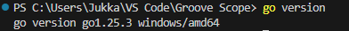
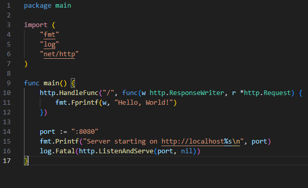
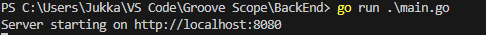
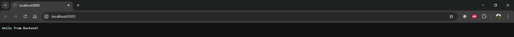
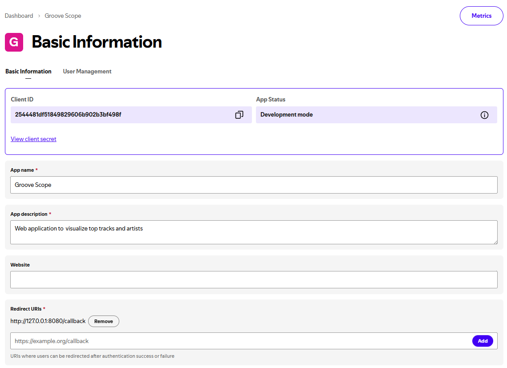
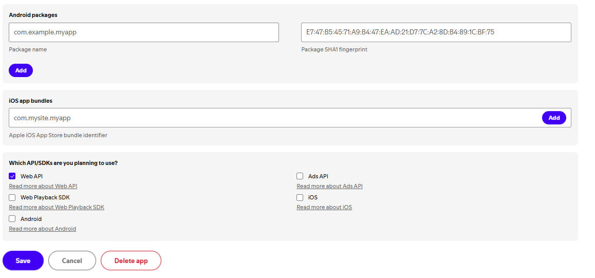

# Projektipäiväkirja - 13.11.2025
## Backendin käynnistys Go:lla
### Lokaalin Go:n asennuksen suoritus
Toinen päivä lähti liikkeelle backendistä. Koska halusin, käyttää Go:ta backendin rakentamiseen. Koska koko Go ohjelmointikielenä on minulle täysin uusi, voi olla etten ehdi tehdä monimutkaisia toiminnallisuuksia sovellukseen. Päätin lähteä liikkeelle hyvin yksinkertaisen palvelimen pystyttämisestä, jonka yritin ensin saada lokaalisti pyörimään. Jotta Go ympäristö toimisi koneellani, minun piti ensin asentaa Go ohjelmointikielen kehitystyökalut. Kävin Go:n virallisella sivustolla ja latasin sieltä uusimman version Go:sta. Asennus sujui ongelmitta, ja sen jälkeen tarkistin terminaalissa komennolla `go version`, että asennus onnistui:   
  
Go:lle oli myös VSCode laajennus, jonka asensin kehitysympäristööni. Laajennus tarjoaa hyödyllisiä ominaisuuksia, kuten syntaksin korostuksen ja koodin täydentämisen, jotka helpottavat Go-koodin kirjoittamista. Kun Go:n asennus oli suoritettu ja kehitysympäristö oli valmisteltu itse ohjelmointikielen osalta, jaoin projektin Frontend ja Backend kansioihin, jotta pysyn paremmin kärryillä siitä mitä teen kummassakin osiossa. Backend-kansion luotuani menin sen sisälle ja aloin suorittamaan palvelimen pystyttämistä 
### Yksinkertaisen HTTP-palvelimen luominen
Go:lla yksinkertaisen HTTP-palvelimen luominen lähti liikkeelle `go mod init` komennolla, jolla luodaan uusi Go-moduuli. Moduuli toimii projektin juurena ja hallinnoi riippuvuuksia. Komennon ajaminen terminaallissa loi BackEnd kansioon myös `go.mod`-nimisen tiedoston, johon oli tallennettu tieto Go:n versiosta sekä moduulini nimi. Seuraavaksi loin `main.go` tiedoston, joka toimii sovelluksen pääsisäänkäyntinä. Tiedostoon kirjoitin koodin, joka määrittelee yksinkertaisen HTTP-palvelimen, joka kuuntelee porttia 8080 ja vastaa "Hello from backend!"-viestillä kaikkiin saapuviin pyyntöihin:   
  

Pääpaketti on määritelty `package main` rivillä, ja `import`-lauseessa tuodaan tarvittavat paketit HTTP-palvelimen luomiseen:
- `fmt`-paketti mahdollistaa tekstin muotoilun ja tulostamisen.
- `net/http` tarjoaa HTTP-palvelimen toiminnallisuuden.
- `log`-paketti mahdollistaa virheiden kirjaamisen.  

`main`-funktio on ohjelman pääsisäänkäynti, jossa määritellään palvelimen toiminta:
- `http.HandleFunc` määrittelee reitin, joka vastaa kaikkiin pyyntöihin juuripolussa ("/"). `Responsewriter` ja `Request`-objektit välitetään käsittelijäfunktioon.
- `fmt.Fprintf` kirjoittaa vastauksen "Hello from backend!" takaisin asiakkaalle.
- `http.ListenAndServe` käynnistää palvelimen portissa 8080. 
- `Fatal`-metodi kirjaa virheen ja lopettaa ohjelman, jos palvelimen käynnistäminen epäonnistuu.   

Tällä yksinkertaisella koodilla sain luotua toimivan HTTP-palvelimen Go:lla. Seuraavaksi yritin käynnistää palvelimen terminaalissa komennolla `go run main.go`, joka käänsi ja suoritti `main.go` tiedoston:  
  
Kun palvelin oli käynnissä, avasin selaimen ja menin osoitteeseen `http://localhost:8080`, jossa näin viestin "Hello from backend!", mikä vahvisti, että palvelin toimi oikein:   
  
### Spotify Developer sovelluksen luominen
Seuraavaksi loin Spotify Developer sovelluksen, jotta voisin myöhemmin hakea Spotify API:sta käyttäjädatan. Menin Spotify Developer Dashboardiin ja loin uuden sovelluksen, jolle annoin nimen "Groove Scope". Sovelluksen luomisen jälkeen sain Client ID:n ja Client Secretin, jotka tarvitsen autentikointiin Spotify API:ta käytettäessä. Tallensin nämä tiedot turvallisesti, sillä niitä tarvitaan myöhemmin backendin kehityksessä. Redirekt URI:n määrittäminen on tärkeä osa OAuth 2.0 -autentikointiprosessia, koska se kertoo Spotifylle, mihin käyttäjä ohjataan takaisin onnistuneen kirjautumisen jälkeen. Määritin redirect URI:ksi `http://127.0.0.1:8080/callback`, koska aion testata sovellusta ensin lokaalisti:   
  

Näiden tietojen lisäksi tarkistin sovellukseni asetuksista, että tarvittavat käyttöoikeudet (scopes) on määritetty, jotta voin hakea käyttäjädatan, kuten kuunteluhistorian ja soittolistat, Spotify API:sta. Tällä hetkellä en ole suunnitellut muiden kuin kuunteluun liittyvien ajallisten käyttäjätietojen hyödyntämistä, joten Web API riittää meille vallan hyvin:   

## Yhteenveto
Tämän päivän aikana sain backendin peruspalvelimen toimimaan Go:lla ja loin Spotify Developer -sovelluksen, joka on välttämätön käyttäjädatan hakemiseen Spotify API:sta. Seuraavaksi tavoitteena on keskittyä OAuth 2.0 -autentikointiprosessin toteuttamiseen backendissä, jotta voin alkaa hakea käyttäjädatan Spotify API:sta.